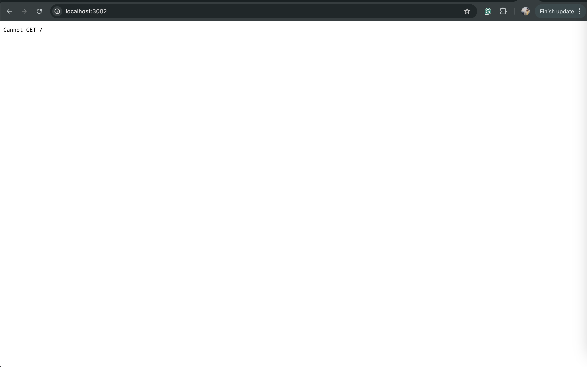
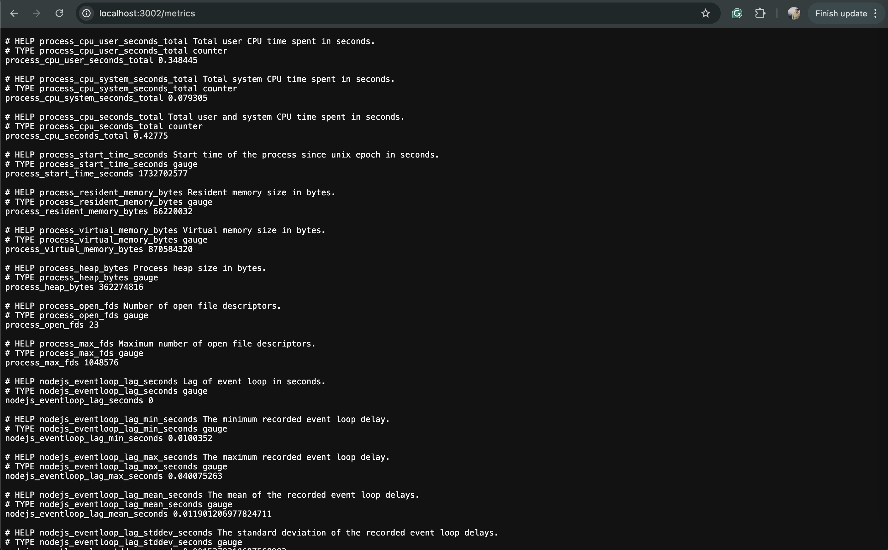

# Store Middleware Application!

#### _Setting up [Store Frontend](https://github.com/yashbhatt1304/StoreFrontend/blob/main/README.md) using AWS EC2._
1. Before setting up the Store Middleware setup the [Store Frontend](https://github.com/yashbhatt1304/StoreFrontend/blob/main/README.md).

#### _Setting up Store Middleware using AWS EC2._
1. Toss up a new server for Store Middleware and allow inbound traffic at port 3002 as our application will run at this port and allow 3100 port as it will be used to fetched using this port and allow the outbound traffic for all.
2. Update the apt and apt-get package manager of our EC2 machine and then Install the docker and docker-compose with below commands.
```sudo apt update && sudo apt-get update```
```sudo apt install docker.io -Y && sudo apt install docker-compose -Y```
3. Fetch the [Store Middleware](https://hub.docker.com/repository/docker/yashbbhatt/store-middleware-linux/general) and run using the docker using below command.
```sudo docker run -d -e PORT=3002 -e ORIGIN=http://54.174.165.94:4000 -e LOKI_HOST=http://34.207.114.61:3100 -p 3002:3002 -p 3100:3100 -p 9090:9090 --name=storeMiddleware  yashbbhatt/store-middleware-linux```
4. Check the 3002 port of your application you will see the below screen and metrics endpoint also "<ip-address>:3002/metrics/" you will see some logs as attached below.



#### _Configure Prometheus_
1. Toss up a new server for monitoring and allow inbound port 9090 for Prometheus and 3000 for Grafana and 3100 for Loki and allow all outbound traffic.
2. Update the apt and apt-get package manager of our EC2 machine and then Install the docker and docker-compose with below commands.
```sudo apt update && sudo apt-get update```
```sudo apt install docker.io -Y && sudo apt install docker-compose -Y```
3. Then prepare a [prometheus.yml](./prometheus.yml) config file in the current EC2 directory or directory of your choice.
4. Then prepare a [docker-compose.yml](./docker-compose.yml) file in the same directory as we did in 3rd step.
5. Now run the docker using docker compose with the below commands.
```sudo docker-compose up```
6. You can check the port 9090, prometheus will be running on this port.

#### _Configure Loki_
1. On the same AWS instance where we configure Prometheus, we'll configure Loki here also.
2. We'll run the Loki using docker with below command.
```docker run -d --name=loki -p 3100:3100 grafana/loki```
3. You can check the port 3100, Loki will be running on this port.

#### _Configure Grafana_
1. 1. On the same AWS instance where we configure Prometheus & Loki, we'll configure Grafana here also.
2. We'll run the Grafana using docker with below command.
```docker run -d -p 3000:3000 --name=grafana grafana/grafana-oss```
3. Yo can check the prot 3000, Grafana will be running on this port.
4. Gave admin as username and password for first time signup in Grafana and setup new password which will be used for access later times.
5. Now add Datasource in grafana by navigating to Datasource section and chosing Prometheus and then providing the uwole url of our Prometheus endpoint.
6. Same we do for Loki also as we did in step 5 for prometheus.

promql querry 
http_requests_total{job="prometheus", route="/metrics"}
rate(http_requests_total{job="prometheus", route="/metrics"}[1m])
sum(rate(http_requests_total{job="prometheus", route=~"/orders.*"}[1m]))
sum(rate(http_requests_total{job="prometheus", route=~"/products.*"}[1m]))
